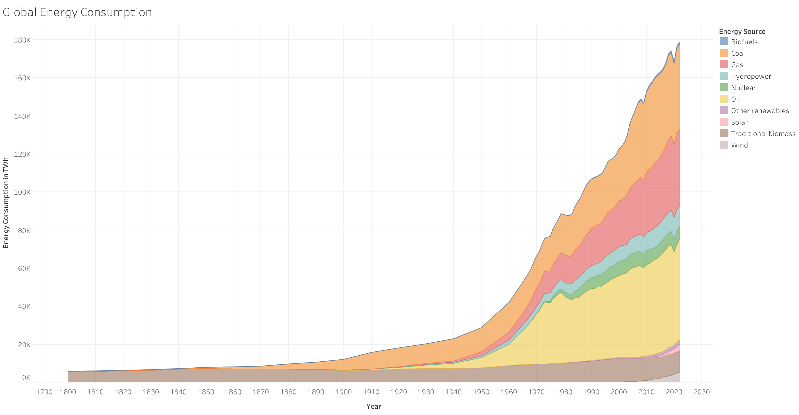

# Global-Energy-Consumption-Tableau

This is just the result of my quick trial of Tableau. 
Tableau is pretty intuitive to use particularly for making graphs or "joining" data, it makes the process much more easier and the results are pretty nice. I will keep on learning this.
This is the result of this quick trial:

